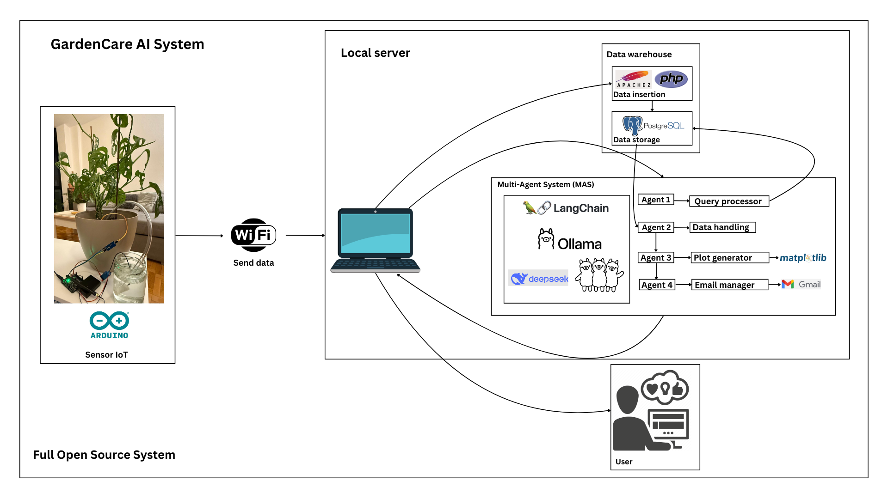
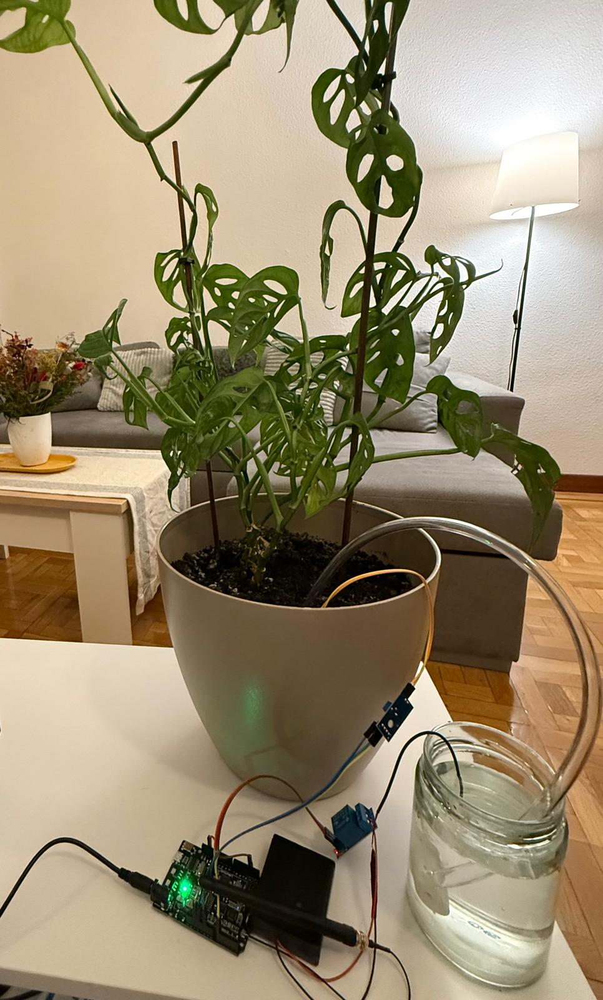

  <h1>GardenCare AI System</h1>

  

## English

Welcome to **GardenCare AI System** – a fully open-source project that automates plant care using IoT, databases, and a multi-agent AI system (MAS).  
This repository contains code and documentation in both English and Spanish.  
For complete details, please refer to the language-specific README files.

## Español

Bienvenido a **GardenCare AI System** – un proyecto 100% de código abierto que automatiza el cuidado de plantas mediante IoT, bases de datos y un sistema multiagentes (MAS) de IA.  
Este repositorio incluye código y documentación en inglés y español.  
Consulta los README correspondientes para obtener todos los detalles.

  

---

### **Contributions / Contribuciones**
Contributions are welcome! ¡Se aceptan contribuciones!
